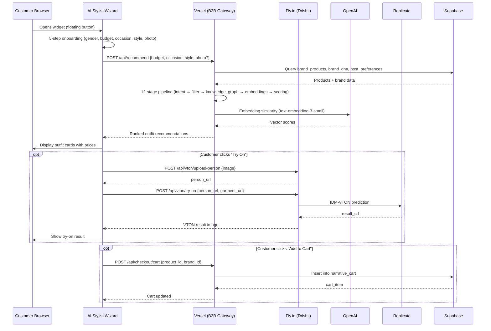
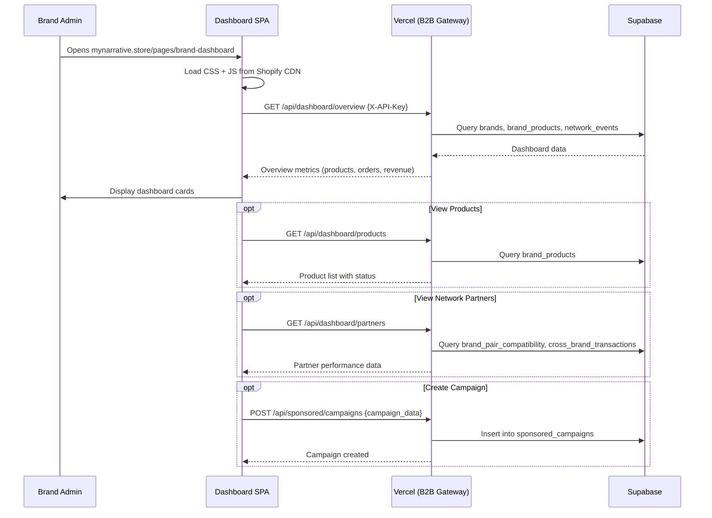
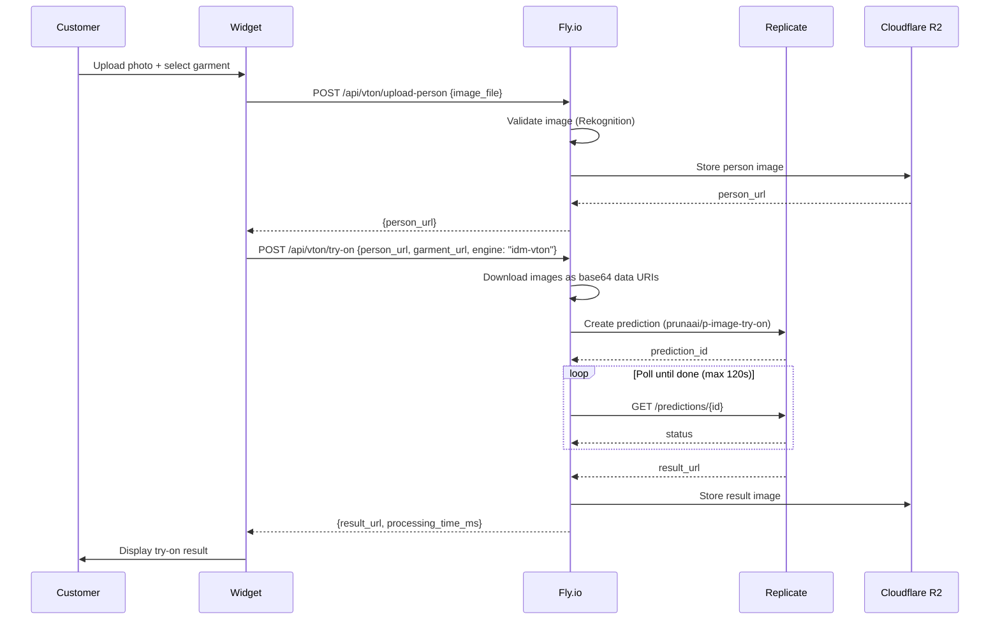
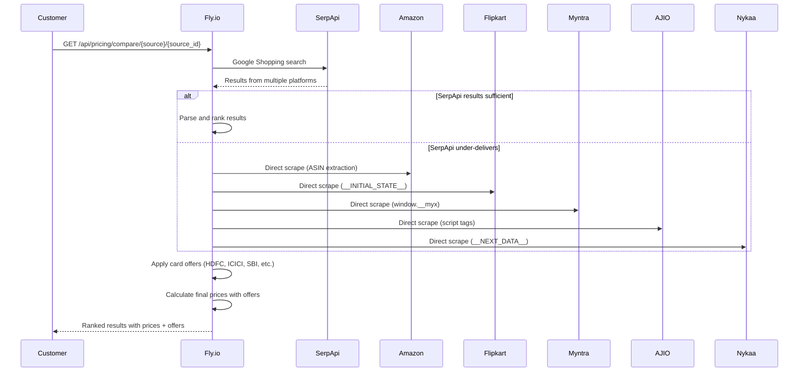
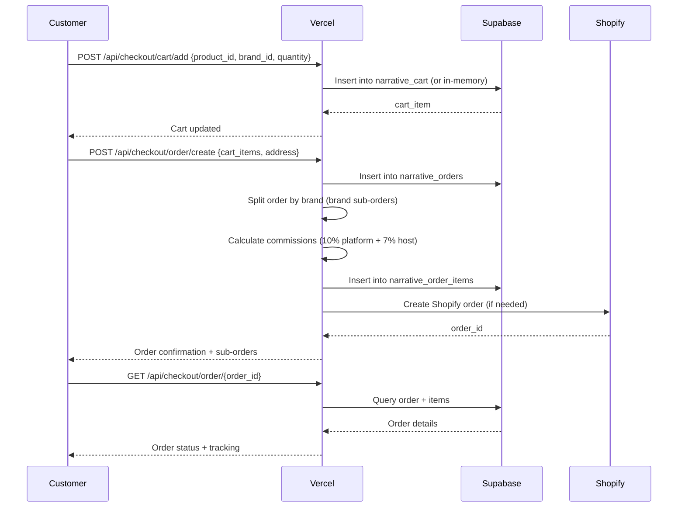
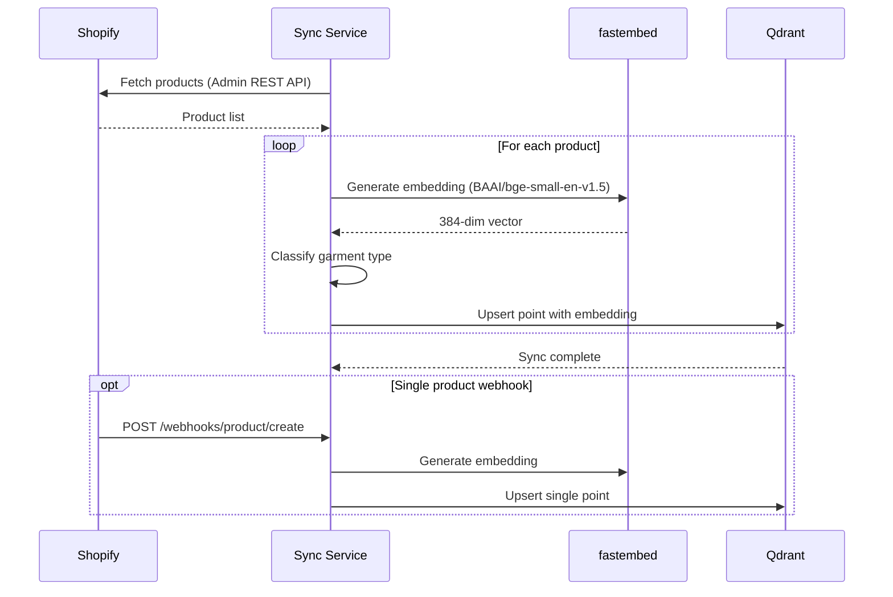

# Data Flow Diagrams

## 1. Customer Recommendation Flow

```mermaid
sequenceDiagram
    participant C as Customer Browser
    participant W as AI Stylist Wizard
    participant V as Vercel (B2B Gateway)
    participant F as Fly.io (Drishti)
    participant O as OpenAI
    participant R as Replicate
    participant S as Supabase

    C->>W: Opens widget (floating button)
    W->>W: 5-step onboarding (gender, budget, occasion, style, photo)
    W->>V: POST /api/recommend {budget, occasion, style, photo?}
    V->>S: Query brand_products, brand_dna, host_preferences
    S-->>V: Products + brand data
    V->>V: 12-stage pipeline (intent → filter → knowledge_graph → embeddings → scoring)
    V->>O: Embedding similarity (text-embedding-3-small)
    O-->>V: Vector scores
    V-->>W: Ranked outfit recommendations
    W->>C: Display outfit cards with prices

    opt Customer clicks "Try On"
        W->>F: POST /api/vton/upload-person {image}
        F-->>W: person_url
        W->>F: POST /api/vton/try-on {person_url, garment_url}
        F->>R: IDM-VTON prediction
        R-->>F: result_url
        F-->>W: VTON result image
        W->>C: Show try-on result
    end

    opt Customer clicks "Add to Cart"
        W->>V: POST /api/checkout/cart {product_id, brand_id}
        V->>S: Insert into narrative_cart
        S-->>V: cart_item
        V-->>W: Cart updated
    end
```

## 2. Brand Dashboard Flow

```mermaid
sequenceDiagram
    participant B as Brand Admin
    participant D as Dashboard SPA
    participant V as Vercel (B2B Gateway)
    participant S as Supabase

    B->>D: Opens mynarrative.store/pages/brand-dashboard
    D->>D: Load CSS + JS from Shopify CDN
    D->>V: GET /api/dashboard/overview {X-API-Key}
    V->>S: Query brands, brand_products, network_events
    S-->>V: Dashboard data
    V-->>D: Overview metrics (products, orders, revenue)
    D->>B: Display dashboard cards

    opt View Products
        D->>V: GET /api/dashboard/products
        V->>S: Query brand_products
        V-->>D: Product list with status
    end

    opt View Network Partners
        D->>V: GET /api/dashboard/partners
        V->>S: Query brand_pair_compatibility, cross_brand_transactions
        V-->>D: Partner performance data
    end

    opt Create Campaign
        D->>V: POST /api/sponsored/campaigns {campaign_data}
        V->>S: Insert into sponsored_campaigns
        V-->>D: Campaign created
    end
```

## 3. VTON Pipeline Flow

```mermaid
sequenceDiagram
    participant C as Customer
    participant W as Widget
    participant F as Fly.io
    participant R as Replicate
    participant RR as Cloudflare R2

    C->>W: Upload photo + select garment
    W->>F: POST /api/vton/upload-person {image_file}
    F->>F: Validate image (Rekognition)
    F->>RR: Store person image
    RR-->>F: person_url
    F-->>W: {person_url}

    W->>F: POST /api/vton/try-on {person_url, garment_url, engine: "idm-vton"}
    F->>F: Download images as base64 data URIs
    F->>R: Create prediction (prunaai/p-image-try-on)
    R-->>F: prediction_id

    loop Poll until done (max 120s)
        F->>R: GET /predictions/{id}
        R-->>F: status
    end

    R-->>F: result_url
    F->>RR: Store result image
    F-->>W: {result_url, processing_time_ms}
    W->>C: Display try-on result
```

## 4. Price Comparison Flow

```mermaid
sequenceDiagram
    participant C as Customer
    participant F as Fly.io
    participant S as SerpApi
    participant AM as Amazon
    participant FK as Flipkart
    participant MN as Myntra
    participant AJ as AJIO
    participant NK as Nykaa

    C->>F: GET /api/pricing/compare/{source}/{source_id}
    F->>S: Google Shopping search
    S-->>F: Results from multiple platforms

    alt SerpApi results sufficient
        F->>F: Parse and rank results
    else SerpApi under-delivers
        F->>AM: Direct scrape (ASIN extraction)
        F->>FK: Direct scrape (__INITIAL_STATE__)
        F->>MN: Direct scrape (window.__myx)
        F->>AJ: Direct scrape (script tags)
        F->>NK: Direct scrape (__NEXT_DATA__)
    end

    F->>F: Apply card offers (HDFC, ICICI, SBI, etc.)
    F->>F: Calculate final prices with offers
    F-->>C: Ranked results with prices + offers
```

## 5. Checkout Flow

```mermaid
sequenceDiagram
    participant C as Customer
    participant V as Vercel
    participant S as Supabase
    participant SH as Shopify

    C->>V: POST /api/checkout/cart/add {product_id, brand_id, quantity}
    V->>S: Insert into narrative_cart (or in-memory)
    S-->>V: cart_item
    V-->>C: Cart updated

    C->>V: POST /api/checkout/order/create {cart_items, address}
    V->>S: Insert into narrative_orders
    V->>V: Split order by brand (brand sub-orders)
    V->>V: Calculate commissions (10% platform + 7% host)
    V->>S: Insert into narrative_order_items
    V->>SH: Create Shopify order (if needed)
    SH-->>V: order_id
    V-->>C: Order confirmation + sub-orders

    C->>V: GET /api/checkout/order/{order_id}
    V->>S: Query order + items
    S-->>V: Order details
    V-->>C: Order status + tracking
```

## 6. Catalog Sync Flow

```mermaid
sequenceDiagram
    participant SH as Shopify
    participant S as Sync Service
    participant E as fastembed
    participant Q as Qdrant

    S->>SH: Fetch products (Admin REST API)
    SH-->>S: Product list

    loop For each product
        S->>E: Generate embedding (BAAI/bge-small-en-v1.5)
        E-->>S: 384-dim vector
        S->>S: Classify garment type
        S->>Q: Upsert point with embedding
    end

    Q-->>S: Sync complete

    opt Single product webhook
        SH->>S: POST /webhooks/product/create
        S->>E: Generate embedding
        S->>Q: Upsert single point
    end
```
